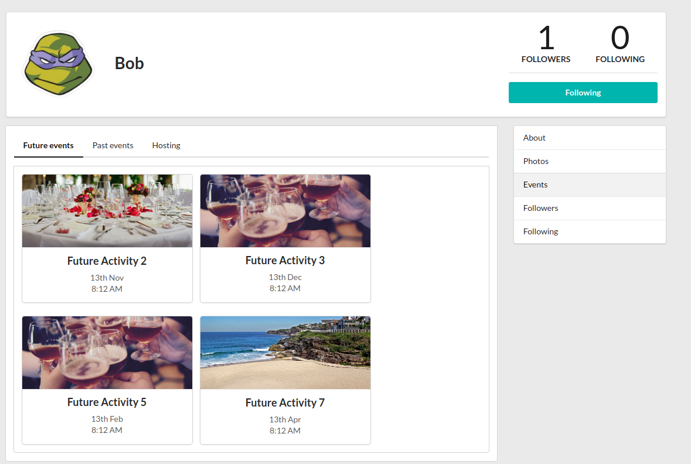

# Reactivities

Reactivities is a social network that allows users to create activities for people to attend them.

---

​

# Functionality

- Register

  ​

- Login/Logout

  ​

- Create/Edit activity

  ​

- Attend/Unattend activity
- View user profiles
  
- Upload/Delete photos - stored in Cloudinary
  ​
- Activity real time chat (SignalR)
  ​
- Filter activities
- Edit profile
  ​

---

## Tecnologies

> CQRS Architecture

- API
  - .NET 5
  - Entity Framework Core
  - SignalR
  - Json Web Tokens (JWT)
- Client
  - TypeScript
  - React && Mobx && Axios
  - Semantic UI
- Databases
  - PostgreSQL
  - SQLite

### Credits

This is app is inspired by Neil Cummings' course on udemy.
